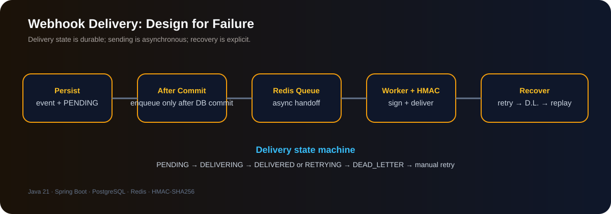

# 🔗 Webhook Delivery Service

<p align="center"><strong>Reliable asynchronous webhook delivery with signing, retries and dead-letter recovery.</strong></p>

<p align="center">   </p>

> A webhook delivery system designed around the failure path: durable delivery state, asynchronous processing, bounded retries, jitter and manual dead-letter recovery.

## 🎯 What This Project Demonstrates

- HMAC-SHA256 signed webhook payloads
- PostgreSQL delivery history
- Redis queueing and background workers
- Exponential backoff with jitter
- Bounded retries and DEAD_LETTER state
- Manual replay and after-commit publishing
- Receiver-side signature verification

## 🧭 Engineering Case Study

| Concern | Design decision | Why it matters |
|---|---|---|
| Durability | Persist event + delivery state before queueing | Delivery intent survives process restarts |
| Database/queue consistency | After-commit publishing | Avoids queueing work for rolled-back transactions |
| Security | HMAC-SHA256 signatures | Receivers can verify payload authenticity |
| Failure recovery | Bounded retry + jitter + DEAD_LETTER + replay | Unavailable receivers do not block the producer |

<p align="center">
  
</p>

## Core Flow

```text
Producer
   |
   v
POST /api/v1/webhooks/{webhookId}/events
   |
   v
PostgreSQL
Event + Delivery(PENDING)
   |
   v
afterCommit
   |
   v
Redis Queue
   |
   v
Delivery Worker
   |
   +-- HMAC-SHA256 signature
   |
   v
Target Webhook
   |
   +-- 2xx --> DELIVERED
   |
   +-- failure --> RETRYING
                     |
                     v
              Exponential backoff
                     |
                     v
                DEAD_LETTER
                     |
                     v
                Manual retry
```

## Features

- Webhook registration
- Per-webhook generated signing secret
- Event creation
- PostgreSQL delivery log
- Redis asynchronous queue
- Background delivery worker
- HMAC-SHA256 payload signing
- Receiver-side signature verification
- Exponential backoff with jitter
- Bounded retries
- `DEAD_LETTER` state
- Manual retry of dead-letter deliveries
- Delivery history API
- Transaction-aware after-commit queue publishing

## API Endpoints

| Method | Endpoint | Purpose |
|---|---|---|
| POST | `/api/v1/webhooks` | Register webhook |
| POST | `/api/v1/webhooks/{webhookId}/events` | Create event |
| GET | `/api/v1/webhooks/{webhookId}/deliveries` | Delivery history |
| POST | `/api/v1/webhooks/deliveries/{deliveryId}/retry` | Manually retry |

### Register Webhook

```http
POST /api/v1/webhooks
Content-Type: application/json
```

```json
{
  "targetUrl": "http://localhost:8084/test-webhook"
}
```

### Create Event

```http
POST /api/v1/webhooks/1/events
Content-Type: application/json
```

```json
{
  "eventType": "payment.created",
  "payload": "{"paymentId":"PAY-1001","amount":500}"
}
```

### Delivery History

```http
GET /api/v1/webhooks/1/deliveries?page=0&size=10
```

### Manual Retry

```http
POST /api/v1/webhooks/deliveries/7/retry
```

## Delivery State Machine

```text
PENDING
   |
   v
DELIVERING
   |
   +---- 2xx ------------> DELIVERED
   |
   +---- failure --------> RETRYING
                              |
                              +---- retry available --> DELIVERING
                              |
                              +---- limit reached ---> DEAD_LETTER
                                                          |
                                                          v
                                                     Manual Retry
                                                          |
                                                          v
                                                       PENDING
```

## HMAC-SHA256

The sender creates:

```text
HMAC-SHA256(rawPayload, webhookSecret)
```

and sends:

```http
X-Webhook-Event: payment.created
X-Webhook-Signature: <signature>
```

The receiver calculates the signature again using the same secret and compares the values.

```text
MATCH    -> 200 OK
MISMATCH -> 401 Unauthorized
```

The receiver must calculate the signature from the **exact raw request body**, not from a deserialized/re-serialized JSON object.

## Retry Policy

Current implementation uses bounded exponential backoff with jitter:

```text
Attempt 1 -> approximately 2–4 sec
Attempt 2 -> approximately 4–6 sec
Attempt 3 -> approximately 8–10 sec
Attempt 4 -> approximately 16–18 sec
Attempt 5 -> DEAD_LETTER
```

This follows the source specification's retry strategy.

## Database Model

```text
webhooks
---------
id
target_url
secret
status
created_at

webhook_events
--------------
id
webhook_id
event_type
payload
created_at

webhook_deliveries
------------------
id
event_id
status
attempt_count
next_attempt_at
last_attempt_at
last_http_status
last_error
created_at
```

Relationships:

```text
Webhook
   |
   +-- WebhookEvent
          |
          +-- WebhookDelivery
```

## Technology Stack

- Java 21
- Spring Boot
- Spring Web
- Spring Data JPA
- PostgreSQL
- Redis
- Spring Validation
- Lombok
- Maven

The source PDF specifies Node.js or Go, Redis/SQS, HMAC-SHA256, and PostgreSQL; this project adapts the same design concepts to Java/Spring Boot.

## Configuration

```yaml
spring:
  application:
    name: webhook-delivery-service

  datasource:
    url: jdbc:postgresql://localhost:5432/webhook_delivery
    username: postgres
    password: ${DB_PASSWORD}

  jpa:
    hibernate:
      ddl-auto: update

  data:
    redis:
      host: localhost
      port: 6379

server:
  port: 8083

management:
  endpoints:
    web:
      exposure:
        include: health,info
```

## Run Locally

Create the database:

```sql
CREATE DATABASE webhook_delivery;
```

Start Redis:

```bash
docker run -d --name webhook-redis -p 6379:6379 redis:7
```

Set the PostgreSQL password:

```powershell
$env:DB_PASSWORD="your-postgres-password"
```

Start the service:

```powershell
mvnw.cmd spring-boot:run
```

## Testing

### Successful delivery

Use a test receiver such as:

```text
http://localhost:8084/test-webhook
```

Expected:

```text
PENDING
  -> DELIVERING
  -> DELIVERED
```

with HTTP status `200`.

### Failed delivery

Use a deliberately unavailable endpoint:

```text
http://localhost:9999/failing-webhook
```

Expected:

```text
PENDING
  -> DELIVERING
  -> RETRYING
  -> RETRYING
  -> ...
  -> DEAD_LETTER
```

### Signature verification

Valid signature:

```text
200 OK
Webhook signature verified
```

Invalid/tampered signature:

```text
401 Unauthorized
```

### Manual recovery

After a delivery reaches `DEAD_LETTER`:

```http
POST /api/v1/webhooks/deliveries/{deliveryId}/retry
```

Expected:

```text
DEAD_LETTER
  -> PENDING
  -> Redis
  -> Worker
  -> DELIVERED
```

## Project Structure

```text
src/main/java/com/rahul/webhook
|
+-- controller
|   +-- WebhookController.java
|
+-- dto
|   +-- CreateWebhookRequest.java
|   +-- CreateWebhookResponse.java
|   +-- CreateWebhookEventRequest.java
|   +-- WebhookEventResponse.java
|   +-- WebhookDeliveryResponse.java
|
+-- entity
|   +-- Webhook.java
|   +-- WebhookStatus.java
|   +-- WebhookEvent.java
|   +-- WebhookDelivery.java
|   +-- DeliveryStatus.java
|
+-- repository
|   +-- WebhookRepository.java
|   +-- WebhookEventRepository.java
|   +-- WebhookDeliveryRepository.java
|
+-- queue
|   +-- WebhookQueueService.java
|   +-- RedisWebhookQueueService.java
|   +-- WebhookQueuePublisher.java
|
+-- security
|   +-- WebhookSignatureService.java
|
+-- worker
|   +-- WebhookDeliveryWorker.java
|
+-- exception
|   +-- ResourceNotFoundException.java
|   +-- GlobalExceptionHandler.java
```

## Engineering Concepts Demonstrated

- Asynchronous delivery
- Queue-based architecture
- Delivery state machines
- HMAC signing
- Exponential backoff
- Retry jitter
- Bounded retries
- Dead-letter recovery
- Manual replay
- PostgreSQL delivery history
- Redis queueing
- Transaction-aware queue publishing
- Background worker processing
- Failure-path testing

## Future Improvements

- Durable outbox table
- Redis Streams or Kafka
- Multiple worker instances
- Distributed worker coordination
- Circuit breaker
- Signature timestamp/replay protection
- Secret rotation
- Per-webhook retry policies
- Docker Compose
- Testcontainers
- Micrometer metrics
- Structured logging
- CI/CD

## Author

**Rahul Moundekar**

Java • Spring Boot • PostgreSQL • Redis • REST APIs • Distributed Systems
